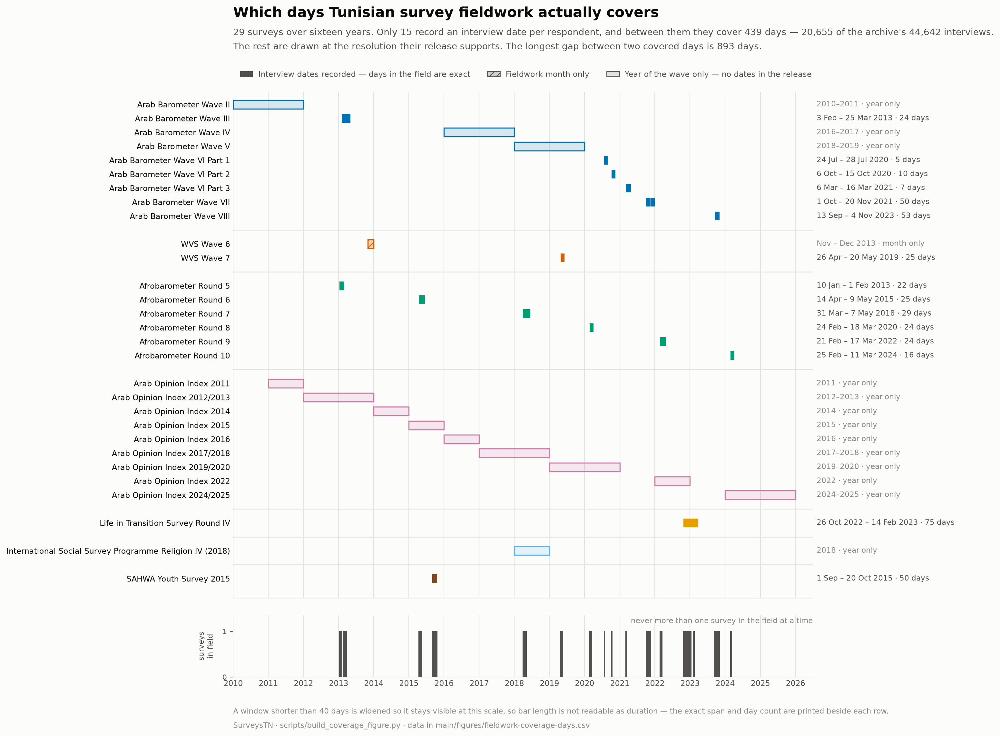

# SurveysTN

Public-opinion survey data covering Tunisia — Arab Barometer, the World Values
Survey, Afrobarometer, the Arab Opinion Index, the EBRD's Life in Transition Survey,
the ISSP and the SAHWA Youth Survey so far — reorganised so that each
survey is one self-describing folder: the respondents, in every common format, with a codebook
and a provenance record.

**44,642 Tunisian respondents across twenty-nine surveys and seven series, 2010 to
2025.** The releases they come from are in the repository too, so a clone can
rebuild the whole archive and check every cell of it against the publishers' own
files.

The programmes do not make this easy. Arab Barometer and the Arab Opinion Index
publish pooled files mixing a dozen or more countries and hundreds of columns never
asked in Tunisia; the other two publish country files, in a different format again.
Between them the surveys arrive in three file formats, two of which lose something.
What is here is the same data, filtered to Tunisia and made consistent, with nothing
recoded.

## What's in it

### Arab Barometer — 9 surveys, 14,008 respondents

| Survey | Respondents | Variables | Fieldwork |
|---|---:|---:|---|
| [Wave II](data/arab-barometer/wave-02) | 1,196 | 468 (303 with data) | 2010–2011 |
| [Wave III](data/arab-barometer/wave-03) | 1,199 | 296 (247 with data) | Feb–Mar 2013 |
| [Wave IV](data/arab-barometer/wave-04) | 1,200 | 290 (248 with data) | 2016–2017 |
| [Wave V](data/arab-barometer/wave-05) | 2,400 | 359 (281 with data) | 2018–2019 |
| [Wave VI Part 1](data/arab-barometer/wave-06-part-1) | 1,005 | 98 (75 with data) | Jul 2020 |
| [Wave VI Part 2](data/arab-barometer/wave-06-part-2) | 1,002 | 82 (78 with data) | Oct 2020 |
| [Wave VI Part 3](data/arab-barometer/wave-06-part-3) | 1,200 | 105 (98 with data) | Mar 2021 |
| [Wave VII](data/arab-barometer/wave-07) | 2,400 | 453 (373 with data) | Oct–Nov 2021 |
| [Wave VIII](data/arab-barometer/wave-08) | 2,406 | 690 (466 with data) | Sep–Nov 2023 |

### World Values Survey — 2 surveys, 2,413 respondents

| Survey | Respondents | Variables | Fieldwork |
|---|---:|---:|---|
| [Wave 6](data/world-values-survey/wave-06) | 1,205 | 370 | Nov–Dec 2013 |
| [Wave 7](data/world-values-survey/wave-07) | 1,208 | 397 | Apr–May 2019 |

### Afrobarometer — 6 surveys, 7,199 respondents

| Survey | Respondents | Variables | Fieldwork |
|---|---:|---:|---|
| [Round 5](data/afrobarometer/round-05) | 1,200 | 300 | Jan–Feb 2013 |
| [Round 6](data/afrobarometer/round-06) | 1,200 | 334 | Apr–May 2015 |
| [Round 7](data/afrobarometer/round-07) | 1,199 | 339 | Mar–May 2018 |
| [Round 8](data/afrobarometer/round-08) | 1,200 | 377 | Feb–Mar 2020 |
| [Round 9](data/afrobarometer/round-09) | 1,200 | 388 (380 with data) | Feb–Mar 2022 |
| [Round 10](data/afrobarometer/round-10) | 1,200 | 372 (363 with data) | Feb–Mar 2024 |

### Arab Opinion Index — 9 surveys, 16,768 respondents

| Survey | Respondents | Variables | Fieldwork |
|---|---:|---:|---|
| [2011](data/arab-opinion-index/2011) | 1,229 | 196 (148 with data) | 2011 |
| [2012/2013](data/arab-opinion-index/2012-2013) | 1,500 | 546 (329 with data) | 2012–2013 |
| [2014](data/arab-opinion-index/2014) | 1,498 | 555 (424 with data) | 2014 |
| [2015](data/arab-opinion-index/2015) | 1,497 | 441 (358 with data) | 2015 |
| [2016](data/arab-opinion-index/2016) | 1,499 | 479 (412 with data) | 2016 |
| [2017/2018](data/arab-opinion-index/2017-2018) | 1,500 | 372 (306 with data) | 2017–2018 |
| [2019/2020](data/arab-opinion-index/2019-2020) | 2,400 | 509 (335 with data) | 2019–2020 |
| [2022](data/arab-opinion-index/2022) | 2,400 | 651 (546 with data) | 2022 |
| [2024/2025](data/arab-opinion-index/2024-2025) | 3,245 | 1,251 (616 with data) | 2024–2025 |

`catalog/catalog.csv` and `catalog/catalog.json` carry the same table in
machine-readable form, with a checksum for every file.

Fieldwork dates given as months are read out of the data, from an interview date
the release records per respondent. Where only a year range is given, the release
has no date variable and the archive reports the publisher's figure for the wave
rather than inventing a Tunisian one.

## Each survey folder

```
data/arab-barometer/wave-08/
├── README.md                              provenance, file listing, what it cost
├── arab-barometer-w08-tunisia.sav         SPSS, full variable and value labels
├── arab-barometer-w08-tunisia.dta         Stata 14
├── arab-barometer-w08-tunisia-codes.csv   numeric codes
├── arab-barometer-w08-tunisia-labels.csv  value labels as text
├── codebook.csv                           one row per variable
└── codebook.json
```

Every data file in a folder holds identical values; pick by tool, not by
preference. Two surveys are missing one of them, and the folder README says why:
**Arab Barometer Wave IV** is published only as label text, so it has no
`-codes.csv`; the **two WVS waves** are published as codes with no value labels
for them, so a `-labels.csv` would only repeat the codes.

Start with [`docs/using-the-data.md`](docs/using-the-data.md), and in particular the
nine things worth checking before you analyse anything — among them the two surveys
you cannot weight, the one that interviewed only 15-to-29-year-olds, don't-know codes
that are not declared missing and differ by survey, and the two things a default CSV
reader silently does to these files.

## When the fieldwork happened



The archive spans sixteen years and does not cover them. Fifteen of the twenty-nine
surveys record an interview date per respondent; between them those cover **389
distinct days**, and no two surveys were ever in the field on the same day — though
Afrobarometer Round 5 and Arab Barometer Wave III came within two days of each other
in early 2013, which is as close to a contemporaneous cross-programme reading as the
archive gets. The longest gap between two covered days is 893 days. The other fourteen releases
carry only a month or a year, and the figure draws them at that resolution rather
than implying more. [`main/figures/README.md`](main/figures/README.md) reads it in
full, and the day-level data sits beside it as CSV.

## Wave VI, and the one derived file

Arab Barometer fielded Wave VI as three telephone rounds during the pandemic,
months apart, each with its own sample and questionnaire, so the archive carries
three surveys rather than one. **They are not a panel.** The `ID` numbers overlap
between rounds, but on the overlapping IDs sex agrees at chance and age almost
never — they are per-release sequence numbers and must not be used to link
respondents.

[`wave-06-merged`](data/arab-barometer/wave-06-merged) stacks the three into 3,207
rows with a `PART` column, for analysis that wants them pooled. It is the only
derived file in the archive, built and verified by script. Its README says what
stacking cost: one variable whose codes were redefined between rounds is held
apart rather than merged, and no pooled weight is supplied because the right one
depends on the estimand.

## Matching surveys to each other

[`docs/crosswalk.md`](docs/crosswalk.md) and the full
[`docs/crosswalk.csv`](docs/crosswalk.csv) line the surveys up: one row per
variable, the name it takes in each survey, the question each one asked, and
whether the wording held. **7,809 variables, 7,743 of them with question text.**

Variables are matched **within a series and never across one**. `Q1` is the
governorate in Arab Barometer and "Important in life: Family" in the World Values
Survey; a name shared between series means nothing.

**A shared name is not evidence of a shared question**, and how far you can trust
one varies by series:

| Series | Present in all its surveys | Flagged for wording that does not match |
|---|---:|---:|
| Arab Barometer | 13 of 1,966 | 97 |
| World Values Survey | 43 of 724 | 3 |
| Afrobarometer | 43 of 987 | 311 |
| Arab Opinion Index | 54 of 2,813 | 3 |
| Life in Transition | — (one survey) | — |
| ISSP | — (one survey) | — |
| SAHWA | — (one survey) | — |

Afrobarometer is the cautionary one: it renumbers between rounds while keeping the
`Q` prefix, so a name that persists is often a different question. Check
`text_varies_across_waves` before pooling anything.

Where a programme renumbers outright, name matching finds nothing at all — WVS
asks as `V9` in Wave 6 what it asks as `Q6` in Wave 7.
[`docs/crosswalk-suggested.csv`](docs/crosswalk-suggested.csv) pairs those up by
question text instead: **859 pairs**, offered only where the wordings are all but
identical, unambiguous, and agreed on any numbers they contain. They are
suggestions to confirm against the publisher's own crosswalk, not findings.

### Life in Transition Survey — 1 survey, 1,036 respondents

| Survey | Respondents | Variables | Fieldwork |
|---|---:|---:|---|
| [Round IV](data/ebrd-life-in-transition/round-04) | 1,036 | 1,319 (741 with data) | 26 Oct 2022 – 14 Feb 2023 |

The EBRD's household and attitudinal survey, run with the World Bank. Round IV is
the first to include Tunisia, and it arrives with an interview date per respondent,
a design weight, a PSU and the seven statistical regions already coded — so it adds
**75 days** to the archive's fieldwork coverage, none of which overlap an existing
survey.

It is the only release here distributed as Stata rather than SPSS, and the only one
that stores dates in Stata's `%tc` form (milliseconds since 1960-01-01). Both are
handled by the extractor; the dates are left as the release stores them.

### International Social Survey Programme — 1 survey, 1,218 respondents

| Survey | Respondents | Variables | Fieldwork |
|---|---:|---:|---|
| [Religion IV (2018)](data/issp/2018-religion) | 1,218 | 139 (138 with data) | 2018 |

The ISSP's 2018 module on religion, deposited with GESIS as ZA7629 by Abdelwahab Ben
Hafaiedh. It is the only survey here that asks about belief and practice in any
detail — what respondents believe about God and an afterlife, how often they pray,
how they feel about Christians, Jews, Hindus, Buddhists and non-believers, and
whether religious leaders should influence a vote. Nothing else in the archive goes
past a mosque-attendance question.

**It is also the least comparable survey here, and the release says so.** GESIS kept
it out of the ISSP 2018 international file because the fieldwork used quota sampling
rather than a probability design and background variables were missing from the first
deposit. The `WEIGHT` variable exists but is empty for every respondent and labelled
"No weighting", so there is no way to weight it. `DATEMO` and `DATEDY` are coded "not
provided" throughout, so only the year is known. `TN_REG` codes 120 sample localities,
not administrative regions, and does not line up with the seven regions the rest of
the archive uses.

Treat it as one Tunisian sample of 1,218 people on questions no other survey here
asks, not as a national estimate, and do not pool it with the rest. It is in the
archive because the questions are not available anywhere else, and it is documented
this heavily so that nobody uses it as though it were.

### SAHWA Youth Survey — 1 survey, 2,000 respondents

| Survey | Respondents | Variables | Fieldwork |
|---|---:|---:|---|
| [2015](data/sahwa/2015-youth) | 2,000 | 843 (735 with data) | 1 Sep – 20 Oct 2015 |

CIDOB's five-country survey of 15-to-29-year-olds, run with RECSM at Universitat
Pompeu Fabra and published on Zenodo under CC BY-NC-SA 4.0. At 2,000 respondents it
is the seventh-largest sample here and the largest of any survey that is not Arab
Barometer or the Arab Opinion Index. It carries an interview date per respondent —
50 days none of the other surveys were in the field for, and the largest single block
of fieldwork in the archive before 2020 — and two weights, a design weight and one
scaled to the population.

**It interviewed only the young, by design.** Everything else here samples adults of
all ages, so a SAHWA marginal is not comparable with a marginal from the survey next
to it, and the difference between them is the age restriction before it is anything
else. Use it for what the general-population surveys are too thin to support: 2,000
young Tunisians interviewed months before the January 2016 Kasserine protests, on
politics (198 variables), work (179), culture and values (172), migration (115) and
education (36).

It also asks the archive's regime battery in its own words — `POL621A`, "a system led
by a strong group that depends neither on parliament nor elections", is the strong-man
item that Arab Barometer and the World Values Survey ask differently — so the topic
lexicon in [`catalog/topics.json`](catalog/topics.json) had to learn its wording. Do
not read those items alongside the general-population series without saying that one
of the lines is 15-to-29-year-olds.

### What is not here

[`docs/not-in-the-archive.md`](docs/not-in-the-archive.md) is the gap list: every
Tunisia survey programme checked, whether it is in the archive, and if not, why.
The short version is that **all seven series here are complete** — each starts where
Tunisia entered it, not short of a wave — and the gaps are whole programmes. Three
remain, each blocked by a different thing rather than by not having been found. The
**Arab Transformations Project** (2014) is on the ACSS Dataverse and unrestricted,
but the depositor requires a guestbook response before a download starts, so it
cannot be fetched by script. **Pew Global Attitudes** (2012–14) needs a Pew account
and its terms restrict redistribution. The **EU Neighbourhood Barometer** (2012–14)
is at GESIS, which answers a scripted request with a challenge page — the same wall
that made the ISSP file here a manual addition. The **Gallup World Poll** covers
Tunisia continuously and cannot be added at all: it is sold under licence.

### Surveys the EBRD and EIB run that are **not** here

The EBRD and the EIB co-fund the **Enterprise Surveys** with the World Bank, and
Tunisia is covered — the 2013 round was a joint World Bank/EBRD/EIB exercise, and a
further round ran from March 2024. They are deliberately absent, for two reasons.

They are **establishment surveys**: the respondent is a firm, not a person, so they
do not answer the questions this archive is organised around and would not share a
unit of analysis with anything in it.

And their microdata is **licensed, not open**. Access requires registering with the
World Bank Microdata Library and signing a confidentiality declaration, which
forbids redistribution — so they could not be committed here even where they fit.
Get them from
[microdata.worldbank.org](https://microdata.worldbank.org/index.php/catalog/enterprise_surveys)
(Tunisia 2013 is catalogue entry 2264, the 2024 round is 6706); the aggregate
indicators are openly available at
[enterprisesurveys.org](https://www.enterprisesurveys.org/).

The EIB's own **Investment Survey (EIBIS)** covers EU member states and does not
include Tunisia.

### The same question in more than one survey

The crosswalk answers what one programme asked across its own waves. It cannot
answer what two programmes both asked, because it matches on names and a name means
nothing between series. [`docs/question-concordance.md`](docs/question-concordance.md)
does that instead: it ignores names and groups variables by the question itself,
anywhere in the archive.

**1,476 question groups span two or more surveys** — 1,398 word-for-word identical,
78 near-identical. **29 span more than one series**, and those are the ones that make
a cross-programme comparison possible at all: employment status, marital status,
trust in the police, in religious leaders and in government, internet use,
interpersonal trust, household income, importance of religion, whether you would
accept neighbours of various kinds.

Twenty-nine is small, and it is the honest number for lexical matching. Two questions
that ask the same thing in different words are not found, so the concordance is a
floor on what is comparable, not a ceiling.

The scales are compared too, and that is where it gets bleak: **not one of the
twenty-nine has an identical response scale** — fourteen differ outright, one is
partly unlabelled, and for fourteen the release labels too little to tell either way.
Every question two programmes both ask, they ask with different answer options —
Afrobarometer scores internet use from never to every day, the Arab Opinion Index
from daily to "I do not use the internet" — or with options the release does not
label at all. A cross-programme series has to
be built by recoding, question by question, with the codebooks open.

### Finding questions on a subject

[`docs/topics/`](docs/topics) indexes the archive by subject rather than by variable:
which of the 29 surveys carry anything on it, in which years, and which items recur
often enough to build a series from. The lexicon is
[`catalog/topics.json`](catalog/topics.json) — a file to read and argue with, not a
judgement buried in code.

**[Inequality](docs/topics/inequality.md)** — 430 variables in 25 of the 29 surveys,
across economic gaps, gender, discrimination, wasta, equality as a principle, and
opportunity. 45 recur across surveys and **not one recurs across two programmes**, so
an inequality series can be built inside Arab Barometer or inside the Arab Opinion
Index and not between them. The only two questions that name Tunisian inequality
directly — Afrobarometer Round 6's "The income gap between the rich and the poor" and
"Regional inequality" — are country-specific items asked once, in 2015. Eight figures
sit on that page. Four take a question as the unit: what the archive holds, which 22
questions are asked in more than two surveys, how the share saying equality is applied
moved, and how Tunisians answered in full. Three take a respondent as the unit, pooling
the 15,539 Arab Opinion Index respondents asked the equality battery between 2012 and
2025: equality is reported to hold across the lines people are born on — skin colour
64%, religion 55%, gender 54% — and to fail across the lines of money and power —
social status 31%, political influence 29%, wealth 26%. It is lowest in the Centre West,
the poorest region and where the 2010 uprising began, and household income is the only
respondent characteristic that orders people cleanly; sex does not separate them at all.
The eighth asks whether perceived inequality is one attitude or several. It is several:
across the 25 inequality items of the 2016 round, the mean correlation inside a battery
is 0.34 and between batteries 0.12.

Four further figures take up **economic and spatial inequality** specifically, using the
two instruments that measure conditions rather than opinions: Afrobarometer's Lived
Poverty Index across six rounds, and its enumeration-area checklist, where an interviewer
records whether a place has piped water, a clinic, a bank, a paved road. A bank is in
reach for 63% of respondents in Grand Tunis and 17% in the North West. Put those beside
the perception data and the two line up: across the seven regions, lived poverty and the
share saying equality is applied correlate at **ρ = −0.89** — and the two axes come from
different programmes, different respondents and different years.

**[Perception of democracy](docs/topics/democracy-perception.md)** — 87 variables in 22
surveys: how democratic people say Tunisia is, how satisfied they are with the way it
works, whether elections are judged free and fair, and what they take the word to mean.
Assessment, not preference. The period is the point — Afrobarometer fielded Round 8
seventeen months before Kais Saied suspended parliament on 25 July 2021 and Round 9 seven
months after, so the break falls between two rounds of an identical question. The share
calling Tunisia a democracy with minor problems or better went **47% → 28% → 53%** across
2020, 2022 and 2024, and satisfaction **55% → 38% → 63%**: it fell hard and then reversed
past where it started. Read the 2024 rise carefully — these are separate cross-sections,
and in 2013 Tunisians ranked delivery far above procedural liberty as essential to
democracy, so the word may not hold its meaning fixed across a change of regime.

A fifth figure on that page tests the claim that **Tunisians turned against democracy**,
four ways across three programmes and 17 surveys. It fails as stated: agreement that
democracy remains better than the alternatives never falls below 81% in nine Arab Opinion
Index rounds and stands at 89% in 2024, and between 2013 and 2019 Tunisians moved away
from every authoritarian alternative they were asked to rate. What did change is
confidence that democracy is decisive, and disapproval of one-man rule — which fell from
84% in 2013 to 40% by early 2020, seventeen months before the coup, while disapproval of
one-party rule barely moved.

A sixth figure runs the same test on the claim that **Tunisians prefer strongman rule**,
and it comes out the other way. Support for choosing leaders by election holds at 77%,
but support for constraining the leader those elections produce has collapsed: parliament
rather than the president making the laws falls from 78% to 33%, the president obeying
laws and courts from 71% to 44%. Elections kept, accountability abandoned — and the
three-item constraint index had already lost 19 of its eventual 28 points by 2018, three
years before parliament was suspended.

A seventh tests **"Tunisians want military rule"** and returns a third verdict: the
archive cannot settle it. Afrobarometer has approval of army rule overtaking disapproval
by 2022 and reaching 56%; the World Values Survey has it a falling minority, 30% in 2019.
Two readings a year apart differ by 17 points. What the usual explanation cannot do is
carry the change — trust in the army has sat at 94–99% across nine rounds and was already
97% in 2011, when only a third approved of army rule. A constant cannot explain a change;
what moved is trust in the elected legislature, from 42% to 14%.

**[Regime preference](docs/topics/regime-preference.md)** — 167 variables in 23
surveys: which system is preferred, support for the non-democratic alternatives
(strong leader, army rule, unelected experts, rule by religious law), support for
democracy against its stated drawbacks, whether democracy suits the country, and
religion as a basis of rule. Preference is kept apart from two things it is
routinely confused with, each in its own facet: how democratic people judge their
own country to be, and how democratic they rate other countries. Exactly **one item
crosses programmes** — "Democratic systems are not effective at maintaining order and
stability", in Arab Barometer Waves VII and VIII and Afrobarometer Round 5 — and even
that one does not share a response scale.

### Where the question text comes from

The release's own variable labels where it has them, and otherwise the survey's
questionnaire in [`docs/questionnaires/`](docs/questionnaires), parsed by question
number. That is the only source for Wave IV, and it also repairs labels truncated
in the release — Arab Barometer's own Wave VIII label for `Q101` ends "the current
economic situation in?".

The parse is checked against release labels rather than trusted: **85–97%
agreement** across the seven surveys where the check means anything. It does not
mean anything everywhere, and those cases say so rather than showing a number.
Wave IV carries no labels at all. Wave V labels every variable from a controlled
vocabulary in capitals — `ELECTORAL PARTICIPATION: VISITED RALLY DURING
PARLIAMENTARY ELECTION` for a question reading "did you attend a campaign meeting
or rally?" — which is correct and shares almost no characters with the wording, so
comparing them would measure labelling style.

**Every survey has its published instrument** in
[`docs/questionnaires/`](docs/questionnaires) — 33 documents, questionnaires and
codebooks, each with its source URL in the catalog.

Nine of them, the Arab Barometer set, are parsed for question text. The rest are
documentation, for two different reasons. The WVS and Arab Opinion Index releases
carry their wording themselves, in column headers and variable labels, so a PDF
would be a second and less reliable source for something the data already states.
Afrobarometer's are deliberately not parsed: it numbers variables differently from
its questionnaire in places — Round 10 labels the variable `Q6` as question `Q5b`,
and 19 more diverge the same way — so mapping question numbers onto variables would
attach the wrong wording.

The documentation still earns its keep. The WVS Wave 7 instrument's first page
defines the negative sentinel codes those releases ship bare, and is what
`docs/missing-value-codes.md` quotes.

## Repository layout

| Path | |
|---|---|
| `data/<series>/<survey>/` | one folder per survey — the extracts |
| `data/arab-barometer/wave-06-merged/` | derived: the three Wave VI rounds stacked |
| `data/raw/` | the publishers' releases, tracked, so the archive rebuilds from a clone |
| `docs/questionnaires/` | the published instrument for every survey — 33 documents |
| `catalog/` | `catalog.json` / `catalog.csv` and the reports, generated; `sources.json`, hand-maintained |
| `docs/` | how to use the data, provenance, the crosswalk, the concordance, missing-value codes |
| `docs/topics/` | the archive indexed by subject, from the lexicon in `catalog/topics.json` |
| `main/figures/` | generated figures and the data behind them |
| `scripts/` | extraction, verification, figures, doc generation |

The clone carries its own sources, which is most of its size; nothing you need for
analysis depends on `data/raw/`.

Two releases are the exception. GitHub refuses a file over 100 MB, and the Arab
Opinion Index rounds for 2019/2020 and 2024/2025 are 132 MB and 202 MB, so those
two are fetched rather than committed:

```bash
python3 scripts/fetch_raw.py     # downloads what is missing, checks the SHA-256
```

They are public downloads needing no registration, and their URLs and checksums
are in the catalog. Everything else is already in the clone.

## Regenerating and verifying

Everything outside `catalog/sources.json`, the questionnaires and the top-level
docs is generated, from the releases in `data/raw/`:

```bash
pip install -r scripts/requirements.txt
python3 scripts/fetch_raw.py              # the two releases too large to commit
python3 scripts/extract_tunisia.py        # extracts + codebooks + catalog
python3 scripts/build_crosswalk.py        # docs/crosswalk.csv, -suggested.csv, crosswalk.md
python3 scripts/build_question_concordance.py   # docs/question-concordance.csv, .md
python3 scripts/build_topic_index.py      # docs/topics/<topic>.csv, .md
python3 scripts/build_wave06_merge.py     # data/arab-barometer/wave-06-merged
python3 scripts/build_missing_codes.py    # docs/missing-value-codes.md
python3 scripts/build_coverage_figure.py  # main/figures/fieldwork-coverage.png
python3 scripts/build_inequality_figures.py     # main/figures/inequality-*.png
python3 scripts/build_inequality_breakdowns.py  # inequality by dimension, region, group
python3 scripts/build_spatial_economic_figures.py  # economic and spatial inequality
python3 scripts/build_democracy_figures.py      # perception of democracy
python3 scripts/verify.py                 # cell-by-cell against the releases
```

`scripts/verify.py` re-derives every subset from its release and compares it cell
by cell, checks the stacked Wave VI file against the three rounds it came from,
confirms every recorded checksum, checks that every survey's questionnaire is
present, opens as a PDF, is not shared with another survey, and records a source, and
checks that every figure a topic page links to has been built. `--offline` is the quicker version, checking
the committed files against the catalog without re-reading the releases.

## Adding a survey

Describe the release in `catalog/sources.json` and re-run the scripts — the
pipeline reads SPSS, label-text CSV and Excel-with-headers releases, and matches
the country either on a code or on a prefix, for programmes that ship country
files with no country column. [`CONTRIBUTING.md`](CONTRIBUTING.md) has the detail
and the ground rules.

## Provenance and terms

Only a row filter is applied — keep the Tunisian respondents — plus a rewrite into
the formats above. Nothing is recoded, rescaled or imputed, and nothing is renamed
except where a format forbids the publisher's own name: Afrobarometer Round 10's
`LOCATION.LEVEL.1` becomes `LOCATION_LEVEL_1`, and 196 variables in the Arab
Opinion Index 2019/2020 round lose a dot from their names the same way. Every such
change is recorded in the catalog and in the survey's own README. Every generated file's SHA-256 is in `catalog/catalog.json`.
[`docs/provenance.md`](docs/provenance.md) lists every departure from the source,
including the handful a file format forced.

The data belongs to the programme that collected it. All three make their data
freely available for research and ask users to register and cite the source; it is
redistributed here for research use. **Cite the programme and the specific wave or
round, not this repository, as the source of the data.**

- Arab Barometer — <https://www.arabbarometer.org>
- World Values Survey — <https://www.worldvaluessurvey.org>
- Afrobarometer — <https://www.afrobarometer.org>
- Arab Opinion Index — <https://arabindex.dohainstitute.org>
