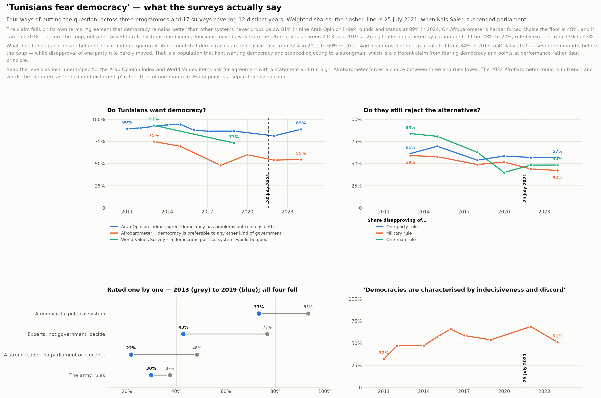
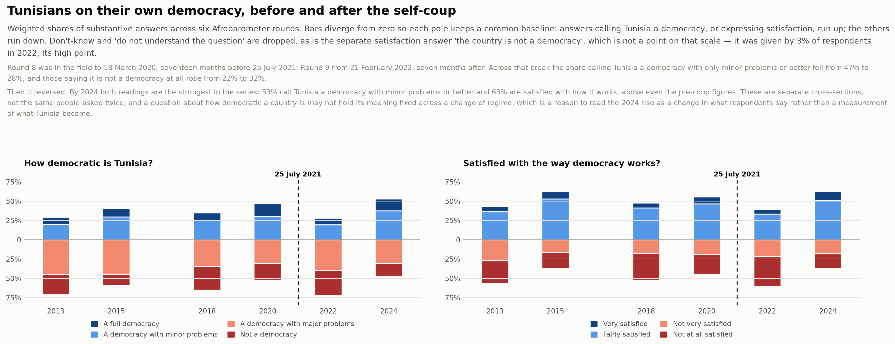
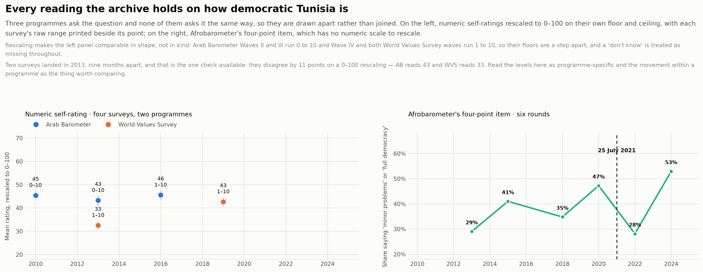
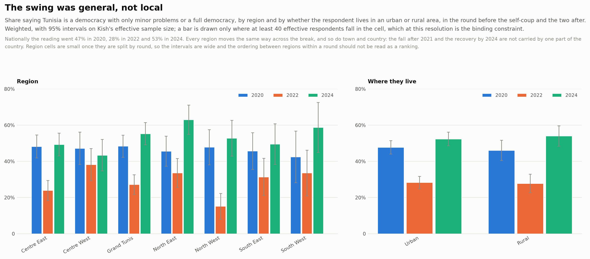
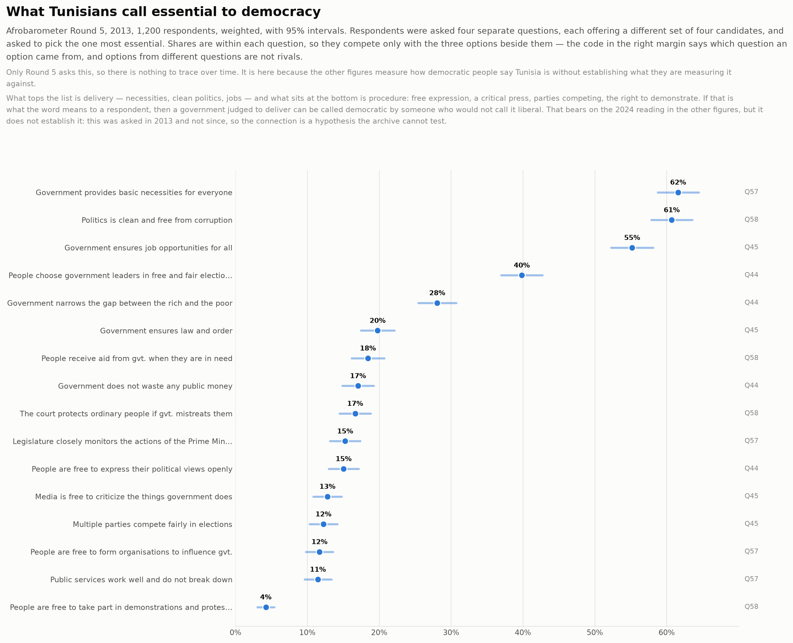

# Perception of democracy

How Tunisians judge and rate democracy — how democratic they say their country is, how satisfied they are with the way it works, what they take democracy to mean, and how free they think elections are. This is assessment, not preference: whether people want democracy is a separate question, indexed under [regime preference](regime-preference.md), which keeps its own assessment facets for the same items seen from the other side.

Generated by `scripts/build_topic_index.py` from the lexicon in
[`catalog/topics.json`](../../catalog/topics.json). The full table is
[`democracy-perception.csv`](democracy-perception.csv), one row per variable.

**87 variables across 22 of the 26 surveys.**

## Figures

### Testing 'Tunisians fear democracy'

The claim tested on its own terms, four ways, across three programmes and 17 surveys. Support for democracy in principle never collapses; what fell is confidence that democracy is decisive, and disapproval of one-man rule — the latter by 2020, before the coup. Draws on items indexed under both this topic and regime preference.

[PNG](../../main/figures/democracy-fear-claim.png) · [SVG](../../main/figures/democracy-fear-claim.svg) · rebuilt with `python3 scripts/build_democracy_figures.py`

### Before and after the self-coup

How democratic Tunisians say their country is, and how satisfied they are with the way it works, across six Afrobarometer rounds. Round 8 was fielded 17 months before 25 July 2021 and Round 9 seven months after; both readings fall sharply across that break and then exceed their pre-coup levels by 2024.

[PNG](../../main/figures/democracy-assessment-and-satisfaction.png) · [SVG](../../main/figures/democracy-assessment-and-satisfaction.svg) · rebuilt with `python3 scripts/build_democracy_figures.py`

### What each programme says

Every reading the archive holds on how democratic Tunisia is, from three programmes that ask it three different ways — drawn apart rather than joined, with the one same-year check reported whichever way it comes out.

[PNG](../../main/figures/democracy-rating-across-programmes.png) · [SVG](../../main/figures/democracy-rating-across-programmes.svg) · rebuilt with `python3 scripts/build_democracy_figures.py`

### Whether the swing was general

The share calling Tunisia a democracy, by region and by urban or rural residence, in the round before the self-coup and the two after.

[PNG](../../main/figures/democracy-perception-who.png) · [SVG](../../main/figures/democracy-perception-who.svg) · rebuilt with `python3 scripts/build_democracy_figures.py`

### What the word is taken to mean

What Tunisians picked as most essential to democracy in 2013: delivery ranks far above procedural liberty, which bears on how a later rating should be read.

[PNG](../../main/figures/democracy-meaning.png) · [SVG](../../main/figures/democracy-meaning.svg) · rebuilt with `python3 scripts/build_democracy_figures.py`

## By facet

| Facet | Variables | Surveys | Series |
|---|---:|---:|---|
| How democratic the country is judged to be | 12 | 11 | AB, Afro, WVS |
| Satisfaction with the way democracy works | 6 | 6 | Afro |
| Whether democracy is judged to be advancing or retreating | 2 | 1 | Afro |
| What democracy is taken to mean | 8 | 3 | AB, Afro |
| Whether elections are judged free and fair | 43 | 16 | AB, AOI, Afro, WVS |
| How democratic other countries are judged to be (a yardstick, not this country) | 12 | 3 | AB, AOI |
| Whether democracy is judged to fit the country | 4 | 4 | AB |

## By survey

Which surveys carry anything on this, and how much. The year is the Tunisian
fieldwork where the release records it and the publisher's range where it does not.

| Survey | Year | Variables |
|---|---|---:|
| AB Wave II | 2010–2011 | 10 |
| AB Wave III | 2013 | 2 |
| AB Wave IV | 2016–2017 | 6 |
| AB Wave V | 2018–2019 | 1 |
| AB Wave VI Part 1 | 2020 | 0 |
| AB Wave VI Part 2 | 2020 | 0 |
| AB Wave VI Part 3 | 2021 | 0 |
| AB Wave VII | 2021 | 0 |
| AB Wave VIII | 2023 | 4 |
| WVS Wave 6 | 2013 | 4 |
| WVS Wave 7 | 2019 | 4 |
| Afro Round 5 | 2013 | 6 |
| Afro Round 6 | 2015 | 5 |
| Afro Round 7 | 2018 | 2 |
| Afro Round 8 | 2020 | 3 |
| Afro Round 9 | 2022 | 4 |
| Afro Round 10 | 2024 | 2 |
| AOI 2011 | 2011 | 8 |
| AOI 2012/2013 | 2012–2013 | 3 |
| AOI 2014 | 2014 | 5 |
| AOI 2015 | 2015 | 5 |
| AOI 2016 | 2016 | 5 |
| AOI 2017/2018 | 2017–2018 | 2 |
| AOI 2019/2020 | 2019–2020 | 4 |
| AOI 2022 | 2022 | 1 |
| AOI 2024/2025 | 2024–2025 | 1 |

## Asked in more than one survey

13 of these questions recur, which is where a series over time
could start. Groups come from [`../question-concordance.md`](../question-concordance.md);
check its `scale` column before pooling, because a repeated question is not
automatically a repeated measurement.

**None of them recurs across two programmes.** Every one belongs to a single
series, so a run over time can be built inside Arab Barometer, or inside the Arab
Opinion Index, and not between them. There is no identical item here to
triangulate on, which is the sharp version of the concordance's finding that no
cross-series question shares a response scale.

| Question | Surveys | Series |
|---|---:|---:|
| Q420_1.Would you agree or disagree with one of the Political parties with which you disagr… | 9 | 1 |
| Q416_5.To what extent do you believe that the The principle of holding regular, free and f… | 6 | 1 |
| Q42. Extent of democracy | 5 | 1 |
| Q43. Satisfaction with democracy | 5 | 1 |
| Q420_2.Would you agree or disagree with one of the Islamist (“Islamic”) political parties … | 5 | 1 |
| Q420_3.Would you agree or disagree with one of the Non-Islamist /secular political parties… | 5 | 1 |
| Q420_4.Would you agree or disagree with one of the Political parties founded along sectari… | 3 | 1 |
| q511 In your opinion, to what extent is your country democratic? | 2 | 1 |
| q509 In your opinion, to what extent is China a democratic country? | 2 | 1 |
| How often in country's elections: Votes are counted fairly | 2 | 1 |
| How often in country's elections: Journalists provide fair coverage of elections | 2 | 1 |
| How often in country's elections: Election officials are fair | 2 | 1 |
| How democratically is this country being governed today | 2 | 1 |

## What the lexicon leaves out, and why

Matching is lexical, so this finds questions that say what they are about. A
question that measures inequality without naming it — asking your income and your
father's, say — is not here, and its absence means nothing.

These words were tried and rejected as false friends:

| Word | Why not |
|---|---|
| `democratic party` | party names containing 'Democratic' are organisations, not judgements |
| `democracy as a preference` | wanting democracy is regime preference; this topic is about how people rate what they have |
| `scale measuring the level of democracy` | the shared preamble of Arab Barometer's rating battery, repeated on the item for every country it asks about — it matched the Iran item as though it were about Tunisia |

The lexicon is [`catalog/topics.json`](../../catalog/topics.json). Widen or narrow
it and re-run `scripts/build_topic_index.py`; nothing else has to change.
