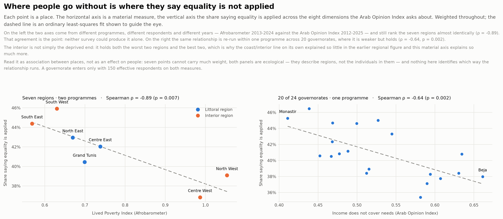
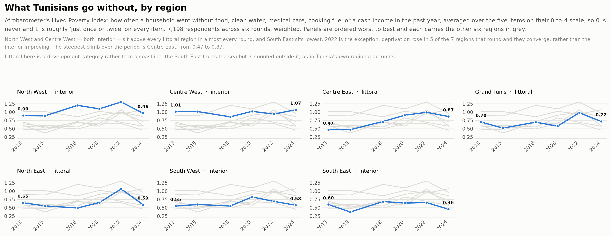
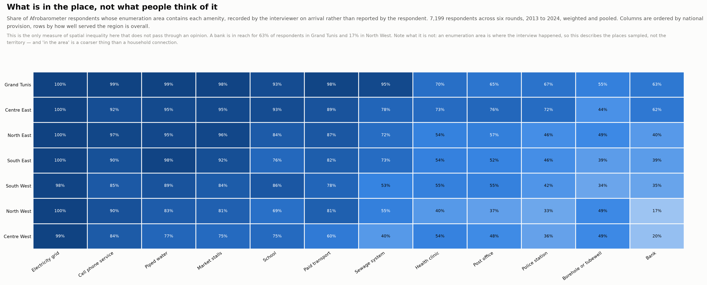
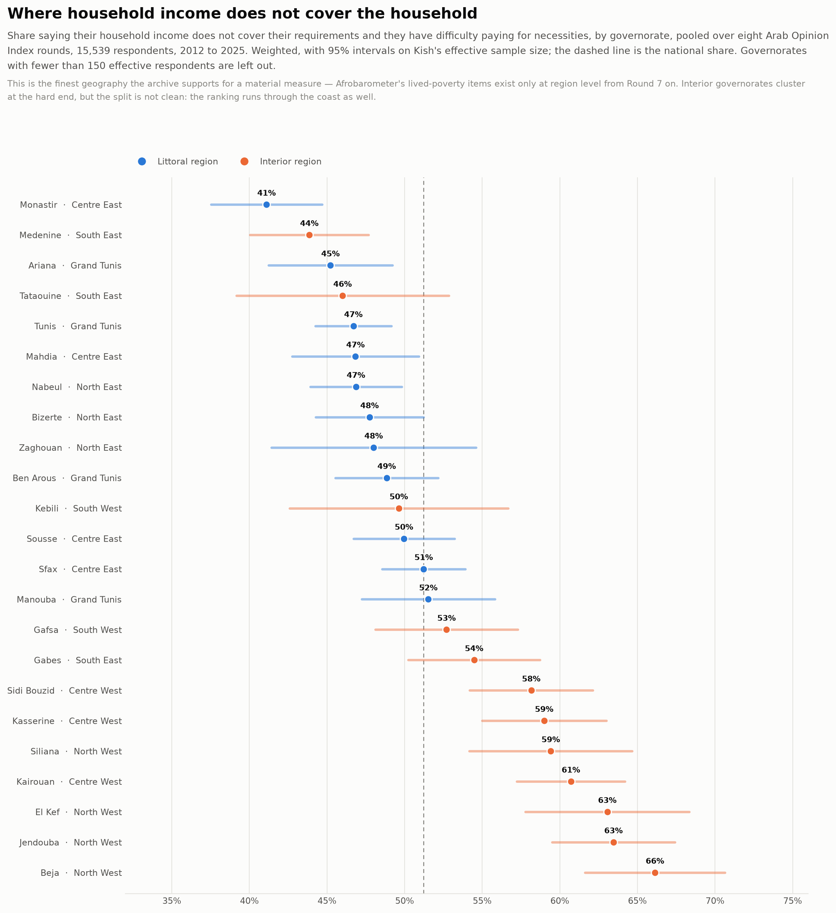
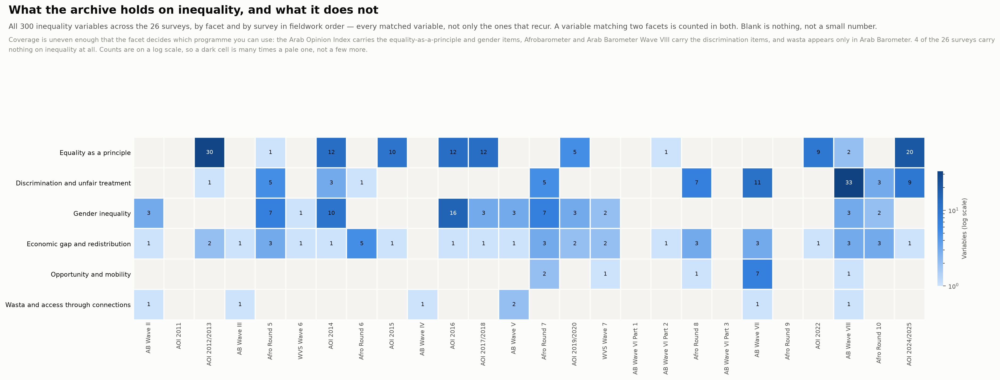
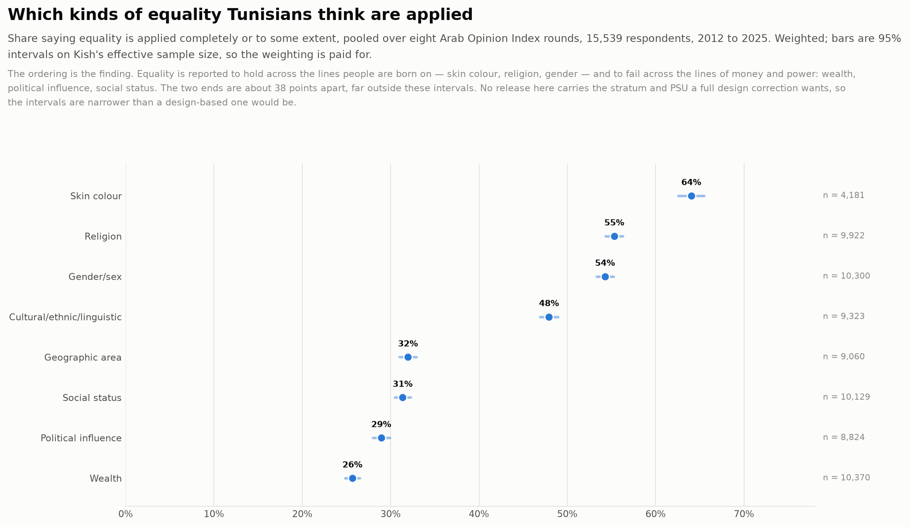
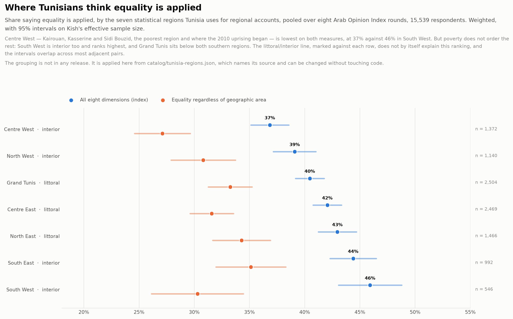
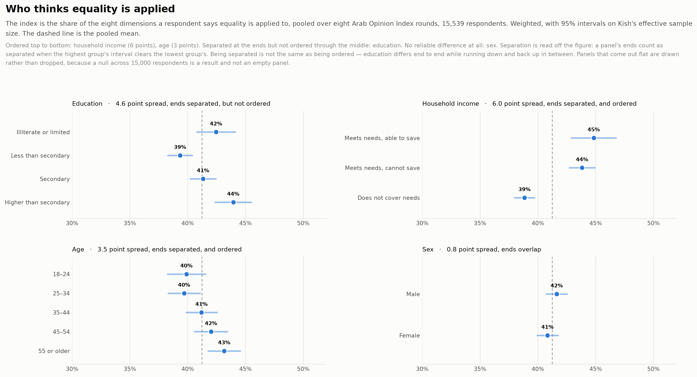

# Inequality

Questions about unequal outcomes, unequal treatment and unequal access, across every survey in the archive.

Generated by `scripts/build_topic_index.py` from the lexicon in
[`catalog/topics.json`](../../catalog/topics.json). The full table is
[`inequality.csv`](inequality.csv), one row per variable.

**418 variables across 23 of the 26 surveys.**

## Figures

### Conditions and perception

Region by region, what people go without against whether they say equality is applied. The two axes come from different programmes and different respondents, and rank the seven regions almost identically (ρ = −0.89); the relationship is re-run across governorates within one programme, where it is weaker but holds.

[PNG](../../main/figures/spatial-conditions-and-perception.png) · [SVG](../../main/figures/spatial-conditions-and-perception.svg) · rebuilt with `python3 scripts/build_spatial_economic_figures.py`

### What people go without

Afrobarometer's Lived Poverty Index — how often a household went without food, clean water, medical care, cooking fuel or cash income — by region across six rounds, 2013 to 2024.

[PNG](../../main/figures/spatial-lived-poverty.png) · [SVG](../../main/figures/spatial-lived-poverty.svg) · rebuilt with `python3 scripts/build_spatial_economic_figures.py`

### What is in the place

Whether the enumeration area has piped water, a sewage system, a clinic, a bank, a paved road, recorded by the interviewer rather than reported by the respondent. The archive's only non-attitudinal measure of spatial inequality.

[PNG](../../main/figures/spatial-provision.png) · [SVG](../../main/figures/spatial-provision.svg) · rebuilt with `python3 scripts/build_spatial_economic_figures.py`

### Hardship by governorate

Share saying household income does not cover the household, by governorate — the finest geography the archive supports for a material measure.

[PNG](../../main/figures/economic-hardship-by-governorate.png) · [SVG](../../main/figures/economic-hardship-by-governorate.svg) · rebuilt with `python3 scripts/build_spatial_economic_figures.py`

### What the archive holds

Every inequality variable in the archive by facet and by survey, in fieldwork order — not only the ones that recur. Coverage is uneven enough that the facet decides which programme you can use.

[PNG](../../main/figures/inequality-archive-map.png) · [SVG](../../main/figures/inequality-archive-map.svg) · rebuilt with `python3 scripts/build_inequality_breakdowns.py`

### What can be followed over time

Every inequality question asked in more than two surveys, and the years it was asked in. A run of dots in one colour is a series that can be built.

[PNG](../../main/figures/inequality-coverage.png) · [SVG](../../main/figures/inequality-coverage.svg) · rebuilt with `python3 scripts/build_inequality_figures.py`

### How it moved

The share saying equality is applied, on one common baseline, with the rest of each question's battery drawn behind it in grey.

[PNG](../../main/figures/inequality-trends.png) · [SVG](../../main/figures/inequality-trends.svg) · rebuilt with `python3 scripts/build_inequality_figures.py`

### How Tunisians answered

How Tunisians answered the recurring questions, as weighted shares of substantive answers. Bars diverge from zero rather than stacking to 100%, so each pole keeps a common baseline; each panel carries its own scale, because the releases do not share one.

[PNG](../../main/figures/inequality-distributions.png) · [SVG](../../main/figures/inequality-distributions.svg) · rebuilt with `python3 scripts/build_inequality_figures.py`

### Which kinds of equality

The share saying equality is applied, by the dimension asked about, pooled over eight Arab Opinion Index rounds with 95% intervals. Equality is reported to hold across the lines people are born on and to fail across the lines of money and power.

[PNG](../../main/figures/inequality-by-dimension.png) · [SVG](../../main/figures/inequality-by-dimension.svg) · rebuilt with `python3 scripts/build_inequality_breakdowns.py`

### Where

The same, by Tunisia's seven statistical regions. The Centre West — the poorest region, and where the 2010 uprising began — is lowest, though poverty does not order the rest.

[PNG](../../main/figures/inequality-by-region.png) · [SVG](../../main/figures/inequality-by-region.svg) · rebuilt with `python3 scripts/build_inequality_breakdowns.py`

### Who

The same, by household income, education, age and sex. Only household income orders people cleanly; sex does not separate them at all.

[PNG](../../main/figures/inequality-by-group.png) · [SVG](../../main/figures/inequality-by-group.svg) · rebuilt with `python3 scripts/build_inequality_breakdowns.py`

### Is it one attitude, or several?

Spearman rank correlations among the 25 inequality items of the survey that can support the most comparisons, grouped by battery. Within one survey only — other surveys are other people.

[PNG](../../main/figures/inequality-correlations.png) · [SVG](../../main/figures/inequality-correlations.svg) · rebuilt with `python3 scripts/build_inequality_figures.py`

## By facet

| Facet | Variables | Surveys | Series |
|---|---:|---:|---|
| Economic gap and redistribution | 40 | 21 | AB, AOI, Afro, WVS |
| Gender inequality | 60 | 12 | AB, AOI, Afro, WVS |
| Discrimination and unfair treatment | 78 | 10 | AB, AOI, Afro |
| Wasta and access through connections | 7 | 6 | AB |
| Equality as a principle | 114 | 11 | AB, AOI, Afro |
| Opportunity and mobility | 12 | 5 | AB, Afro, WVS |
| Lived poverty and going without | 37 | 8 | Afro, WVS |
| Spatial and regional inequality | 91 | 13 | AOI, Afro |

## By survey

Which surveys carry anything on this, and how much. The year is the Tunisian
fieldwork where the release records it and the publisher's range where it does not.

| Survey | Year | Variables |
|---|---|---:|
| AB Wave II | 2010–2011 | 5 |
| AB Wave III | 2013 | 2 |
| AB Wave IV | 2016–2017 | 1 |
| AB Wave V | 2018–2019 | 6 |
| AB Wave VI Part 1 | 2020 | 0 |
| AB Wave VI Part 2 | 2020 | 2 |
| AB Wave VI Part 3 | 2021 | 0 |
| AB Wave VII | 2021 | 18 |
| AB Wave VIII | 2023 | 43 |
| WVS Wave 6 | 2013 | 5 |
| WVS Wave 7 | 2019 | 8 |
| Afro Round 5 | 2013 | 27 |
| Afro Round 6 | 2015 | 24 |
| Afro Round 7 | 2018 | 34 |
| Afro Round 8 | 2020 | 31 |
| Afro Round 9 | 2022 | 20 |
| Afro Round 10 | 2024 | 27 |
| AOI 2011 | 2011 | 0 |
| AOI 2012/2013 | 2012–2013 | 33 |
| AOI 2014 | 2014 | 26 |
| AOI 2015 | 2015 | 11 |
| AOI 2016 | 2016 | 29 |
| AOI 2017/2018 | 2017–2018 | 16 |
| AOI 2019/2020 | 2019–2020 | 10 |
| AOI 2022 | 2022 | 10 |
| AOI 2024/2025 | 2024–2025 | 30 |

## Asked in more than one survey

69 of these questions recur, which is where a series over time
could start. Groups come from [`../question-concordance.md`](../question-concordance.md);
check its `scale` column before pooling, because a repeated question is not
automatically a repeated measurement.

**None of them recurs across two programmes.** Every one belongs to a single
series, so a run over time can be built inside Arab Barometer, or inside the Arab
Opinion Index, and not between them. There is no identical item here to
triangulate on, which is the sharp version of the concordance's finding that no
cross-series question shares a response scale.

| Question | Surveys | Series |
|---|---:|---:|
| Q210_5.How would you evaluate the government’s performance in Improving the standard of li… | 8 | 1 |
| Q422_1.to what extent do you believe that the Equality of all citizens regardless of wealt… | 8 | 1 |
| Q422_2.to what extent do you believe that the Equality of all citizens regardless of gende… | 8 | 1 |
| Q422_3.to what extent do you believe that the Equality of all citizens regardless of relig… | 8 | 1 |
| Q422_4.to what extent do you believe that the Equality of all citizens regardless of socia… | 8 | 1 |
| Q422_5.to what extent do you believe that the Equality of all citizens regardless of cultu… | 8 | 1 |
| Q422_6.to what extent do you believe that the Equality of all citizens regardless of their… | 7 | 1 |
| Q422_7.to what extent do you believe that the Equality of all citizens regardless of their… | 7 | 1 |
| Q422_8.to what extent do you believe that the Equality of citizens regardless of their rel… | 7 | 1 |
| Q422_9.to what extent do you believe that the Equality of all citizens regardless of their… | 7 | 1 |
| EA-FAC-A. Post office in the PSU/EA | 5 | 1 |
| EA-FAC-B. School in the PSU/EA | 5 | 1 |
| EA-FAC-C. Police station in the PSU/EA | 5 | 1 |
| EA-FAC-D. Health Clinic in the PSU/EA | 5 | 1 |
| EA-FAC-E. Market stalls in the PSU/EA | 5 | 1 |
| EA-SVC-A. Electricity grid in the PSU/EA | 5 | 1 |
| EA-SVC-B. Piped water system in the PSU/EA | 5 | 1 |
| EA-SVC-C. Sewage system in the PSU/EA | 5 | 1 |
| Q65b. Handling improving living standards of the poor | 5 | 1 |
| Q8a. How often gone without food | 5 | 1 |
| Q8b. How often gone without water | 5 | 1 |
| Q8c. How often gone without medical care | 5 | 1 |
| Q8d. How often gone without cooking fuel | 5 | 1 |
| Q8e. How often gone without cash income | 5 | 1 |
| Q65e. Handling narrowing income gaps | 5 | 1 |
| EA-SVC-D. Cell phone service in the PSU/EA | 4 | 1 |
| EA-FAC-G. Paid transport in the PSU/EA | 4 | 1 |
| Q56b. How often people treated unequally | 4 | 1 |
| Q422_12.to what extent do you believe that the Equality of all citizens regardless of leve… | 4 | 1 |
| Q504_10.Please indicate your level of personal agreement/disagreement with each of this Me… | 4 | 1 |
| Q504_3.Please indicate your level of personal agreement/disagreement with each of this In … | 4 | 1 |
| Q504_5.Please indicate your level of personal agreement/disagreement with each of this Men… | 4 | 1 |
| EA-ROAD-A. Road surface at start point | 3 | 1 |
| EA-ROAD-B. Road surface last 5 km | 3 | 1 |
| EA-ROAD-C. Road condition last 5 km | 3 | 1 |
| Q4. Your living conditions vs. others | 3 | 1 |
| Q204_3. Narrowing the gap between rich and poor | 3 | 1 |
| Q422_10.to what extent do you believe that the Equality of all citizens in (the West Bank/… | 3 | 1 |
| Q422_13.to what extent do you believe that the Equality for all citizens, regardless of so… | 3 | 1 |
| Q422_14.to what extent do you believe that the Equality for all citizens, regardless of sk… | 3 | 1 |
| _…and 29 more in the CSV_ | | |

## Asked only in Tunisia

Country-specific items, which exist nowhere else and cannot recur:

| Survey | Variable | Question |
|---|---|---|
| afro-w06 | `Q83_TUN_E` | Q83_TUN_e. The income gap between the rich and the poor |
| afro-w06 | `Q83_TUN_F` | Q83_TUN_f. Regional inequality |

## What the lexicon leaves out, and why

Matching is lexical, so this finds questions that say what they are about. A
question that measures inequality without naming it — asking your income and your
father's, say — is not here, and its absence means nothing.

These words were tried and rejected as false friends:

| Word | Why not |
|---|---|
| `fair` | free and fair elections, fair count of votes, fair coverage, fair punishment — electoral and judicial fairness, not distributive |
| `class` | overcrowded classrooms, religious classes |
| `poor` | poor teaching, poor services, poor condition of facilities — quality, not poverty |
| `region` | province or region sampling variables, and regional organisations such as the Arab Maghreb Union |
| `tax` | tax compliance and tax authority questions, which are about the state's reach rather than redistribution |
| `living conditions compared` | 'your living conditions compared to 12 months ago' is a change over time, not a gap between people; only the relational form is matched |

The lexicon is [`catalog/topics.json`](../../catalog/topics.json). Widen or narrow
it and re-run `scripts/build_topic_index.py`; nothing else has to change.
