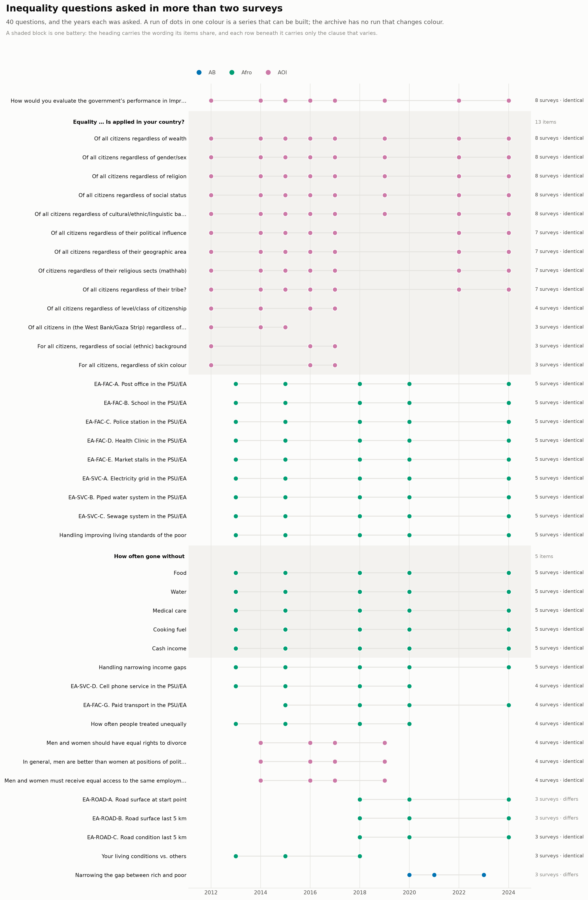
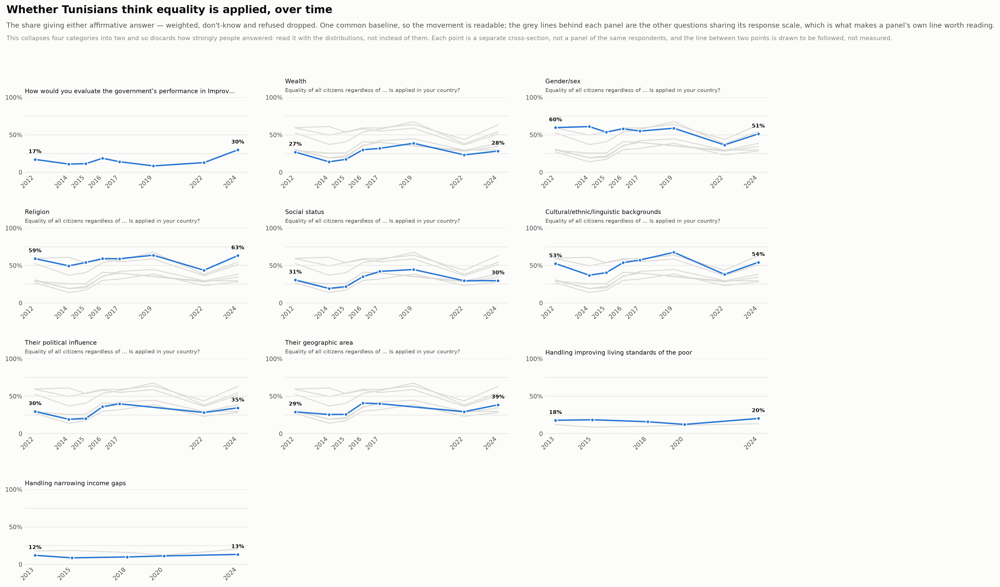
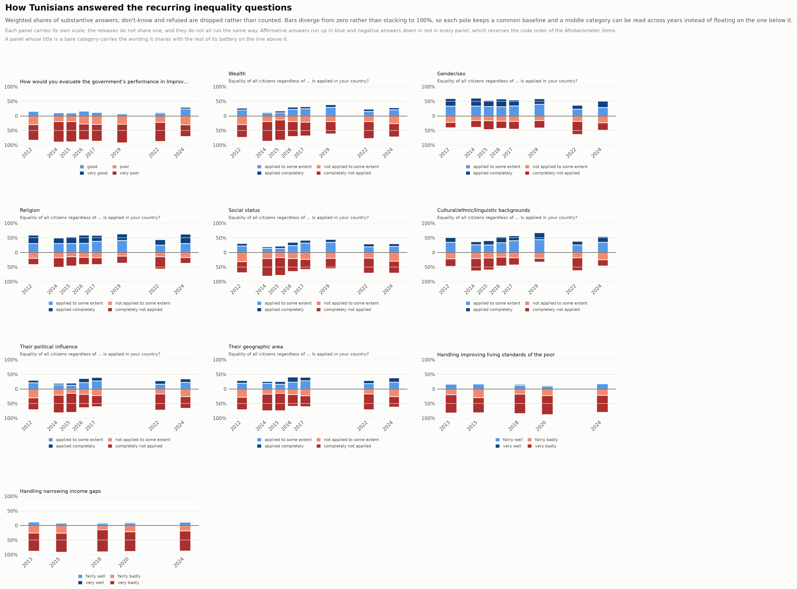
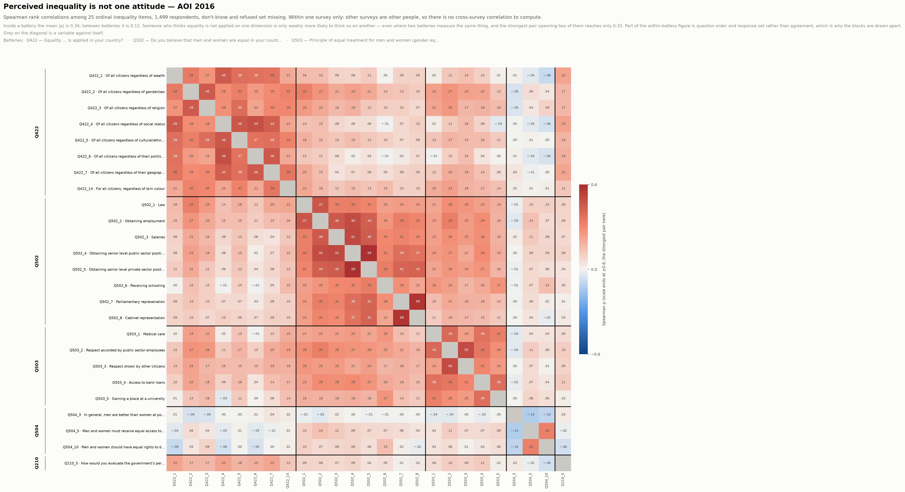

# Inequality

Questions about unequal outcomes, unequal treatment and unequal access, across every survey in the archive.

Generated by `scripts/build_topic_index.py` from the lexicon in
[`catalog/topics.json`](../../catalog/topics.json). The full table is
[`inequality.csv`](inequality.csv), one row per variable.

**300 variables across 22 of the 26 surveys.**

## Figures

### What can be followed over time

Every inequality question asked in more than two surveys, and the years it was asked in. A run of dots in one colour is a series that can be built.

[PNG](../../main/figures/inequality-coverage.png) · [SVG](../../main/figures/inequality-coverage.svg) · rebuilt with `python3 scripts/build_inequality_figures.py`

### How it moved

The share saying equality is applied, on one common baseline, with the rest of each question's battery drawn behind it in grey.

[PNG](../../main/figures/inequality-trends.png) · [SVG](../../main/figures/inequality-trends.svg) · rebuilt with `python3 scripts/build_inequality_figures.py`

### How Tunisians answered

How Tunisians answered the recurring questions, as weighted shares of substantive answers. Bars diverge from zero rather than stacking to 100%, so each pole keeps a common baseline; each panel carries its own scale, because the releases do not share one.

[PNG](../../main/figures/inequality-distributions.png) · [SVG](../../main/figures/inequality-distributions.svg) · rebuilt with `python3 scripts/build_inequality_figures.py`

### Whether the items move together

Spearman rank correlations among the inequality items of the survey that carries the most of them. Within one survey only — other surveys are other people.

[PNG](../../main/figures/inequality-correlations.png) · [SVG](../../main/figures/inequality-correlations.svg) · rebuilt with `python3 scripts/build_inequality_figures.py`

## By facet

| Facet | Variables | Surveys | Series |
|---|---:|---:|---|
| Economic gap and redistribution | 40 | 21 | AB, AOI, Afro, WVS |
| Gender inequality | 60 | 12 | AB, AOI, Afro, WVS |
| Discrimination and unfair treatment | 78 | 10 | AB, AOI, Afro |
| Wasta and access through connections | 7 | 6 | AB |
| Equality as a principle | 114 | 11 | AB, AOI, Afro |
| Opportunity and mobility | 12 | 5 | AB, Afro, WVS |

## By survey

Which surveys carry anything on this, and how much. The year is the Tunisian
fieldwork where the release records it and the publisher's range where it does not.

| Survey | Year | Variables |
|---|---|---:|
| AB Wave II | 2010–2011 | 5 |
| AB Wave III | 2013 | 2 |
| AB Wave IV | 2016–2017 | 1 |
| AB Wave V | 2018–2019 | 6 |
| AB Wave VI Part 1 | 2020 | 0 |
| AB Wave VI Part 2 | 2020 | 2 |
| AB Wave VI Part 3 | 2021 | 0 |
| AB Wave VII | 2021 | 18 |
| AB Wave VIII | 2023 | 43 |
| WVS Wave 6 | 2013 | 2 |
| WVS Wave 7 | 2019 | 4 |
| Afro Round 5 | 2013 | 13 |
| Afro Round 6 | 2015 | 6 |
| Afro Round 7 | 2018 | 15 |
| Afro Round 8 | 2020 | 11 |
| Afro Round 9 | 2022 | 0 |
| Afro Round 10 | 2024 | 7 |
| AOI 2011 | 2011 | 0 |
| AOI 2012/2013 | 2012–2013 | 33 |
| AOI 2014 | 2014 | 26 |
| AOI 2015 | 2015 | 11 |
| AOI 2016 | 2016 | 29 |
| AOI 2017/2018 | 2017–2018 | 16 |
| AOI 2019/2020 | 2019–2020 | 10 |
| AOI 2022 | 2022 | 10 |
| AOI 2024/2025 | 2024–2025 | 30 |

## Asked in more than one survey

45 of these questions recur, which is where a series over time
could start. Groups come from [`../question-concordance.md`](../question-concordance.md);
check its `scale` column before pooling, because a repeated question is not
automatically a repeated measurement.

**None of them recurs across two programmes.** Every one belongs to a single
series, so a run over time can be built inside Arab Barometer, or inside the Arab
Opinion Index, and not between them. There is no identical item here to
triangulate on, which is the sharp version of the concordance's finding that no
cross-series question shares a response scale.

| Question | Surveys | Series |
|---|---:|---:|
| Q210_5.How would you evaluate the government’s performance in Improving the standard of li… | 8 | 1 |
| Q422_1.to what extent do you believe that the Equality of all citizens regardless of wealt… | 8 | 1 |
| Q422_2.to what extent do you believe that the Equality of all citizens regardless of gende… | 8 | 1 |
| Q422_3.to what extent do you believe that the Equality of all citizens regardless of relig… | 8 | 1 |
| Q422_4.to what extent do you believe that the Equality of all citizens regardless of socia… | 8 | 1 |
| Q422_5.to what extent do you believe that the Equality of all citizens regardless of cultu… | 8 | 1 |
| Q422_6.to what extent do you believe that the Equality of all citizens regardless of their… | 7 | 1 |
| Q422_7.to what extent do you believe that the Equality of all citizens regardless of their… | 7 | 1 |
| Q422_8.to what extent do you believe that the Equality of citizens regardless of their rel… | 7 | 1 |
| Q422_9.to what extent do you believe that the Equality of all citizens regardless of their… | 7 | 1 |
| Q65b. Handling improving living standards of the poor | 5 | 1 |
| Q65e. Handling narrowing income gaps | 5 | 1 |
| Q56b. How often people treated unequally | 4 | 1 |
| Q422_12.to what extent do you believe that the Equality of all citizens regardless of leve… | 4 | 1 |
| Q504_10.Please indicate your level of personal agreement/disagreement with each of this Me… | 4 | 1 |
| Q504_3.Please indicate your level of personal agreement/disagreement with each of this In … | 4 | 1 |
| Q504_5.Please indicate your level of personal agreement/disagreement with each of this Men… | 4 | 1 |
| Q4. Your living conditions vs. others | 3 | 1 |
| Q204_3. Narrowing the gap between rich and poor | 3 | 1 |
| Q422_10.to what extent do you believe that the Equality of all citizens in (the West Bank/… | 3 | 1 |
| Q422_13.to what extent do you believe that the Equality for all citizens, regardless of so… | 3 | 1 |
| Q422_14.to what extent do you believe that the Equality for all citizens, regardless of sk… | 3 | 1 |
| Q56s. Handling protecting rights, promoting opportunities for disabled | 2 | 1 |
| Q82a. Ethnic group treated unfairly by government | 2 | 1 |
| q2043 I am going to ask a number of questions related to the current government’s performa… | 2 | 1 |
| Q114. Do you think the gap between the rich and the poor a year ago was wider, the same, o… | 2 | 1 |
| Q421_1.Do you think the availability of Equality of all citizens regardless of wealth in y… | 2 | 1 |
| Q421_2.Do you think the availability of Equality of all citizens regardless of gender/sex … | 2 | 1 |
| Q421_3.Do you think the availability of Equality of all citizens regardless of religion in… | 2 | 1 |
| Q421_4.Do you think the availability of Equality of all citizens regardless of social stat… | 2 | 1 |
| Q421_5.Do you think the availability of Equality of all citizens regardless of cultural/et… | 2 | 1 |
| Q421_6.Do you think the availability of Equality of all citizens regardless of their polit… | 2 | 1 |
| Q421_7.Do you think the availability of Equality of all citizens regardless of their geogr… | 2 | 1 |
| Q421_8.Do you think the availability of Equality of citizens regardless of their religious… | 2 | 1 |
| Q421_9.Do you think the availability of Equality of all citizens regardless of their tribe… | 2 | 1 |
| Q422_11.to what extent do you believe that the Equality of all citizens regardless of bein… | 2 | 1 |
| Q503_1.To what extent do you think that the principle of equal treatment for men and women… | 2 | 1 |
| Q503_2.To what extent do you think that the principle of equal treatment for men and women… | 2 | 1 |
| Q503_3.To what extent do you think that the principle of equal treatment for men and women… | 2 | 1 |
| Q503_4.To what extent do you think that the principle of equal treatment for men and women… | 2 | 1 |
| _…and 5 more in the CSV_ | | |

## Asked only in Tunisia

Country-specific items, which exist nowhere else and cannot recur:

| Survey | Variable | Question |
|---|---|---|
| afro-w06 | `Q83_TUN_E` | Q83_TUN_e. The income gap between the rich and the poor |
| afro-w06 | `Q83_TUN_F` | Q83_TUN_f. Regional inequality |

## What the lexicon leaves out, and why

Matching is lexical, so this finds questions that say what they are about. A
question that measures inequality without naming it — asking your income and your
father's, say — is not here, and its absence means nothing.

These words were tried and rejected as false friends:

| Word | Why not |
|---|---|
| `fair` | free and fair elections, fair count of votes, fair coverage, fair punishment — electoral and judicial fairness, not distributive |
| `class` | overcrowded classrooms, religious classes |
| `poor` | poor teaching, poor services, poor condition of facilities — quality, not poverty |
| `region` | province or region sampling variables, and regional organisations such as the Arab Maghreb Union |
| `tax` | tax compliance and tax authority questions, which are about the state's reach rather than redistribution |
| `living conditions compared` | 'your living conditions compared to 12 months ago' is a change over time, not a gap between people; only the relational form is matched |

The lexicon is [`catalog/topics.json`](../../catalog/topics.json). Widen or narrow
it and re-run `scripts/build_topic_index.py`; nothing else has to change.
